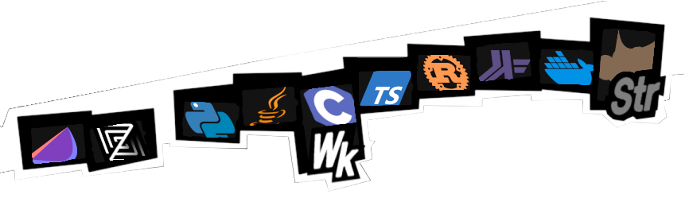

  
## Welcome to my palace !

My name is Pauline and I graduated from [TELECOM Nancy](https://telecomnancy.univ-lorraine.fr/) in the IL (Software Engineering) specialization.

I mostly specialize in backend development (with the very little experience I have), though I am trying to learn Godot as all the amazing ideas I write tons of documentation about won't code themselves.

I usually do the Advent of Code in languages I am learning ! You may see weird ones in there some time soon...

<!--
**LeBoufty/LeBoufty** is a ✨ _special_ ✨ repository because its `README.md` (this file) appears on your GitHub profile.

Here are some ideas to get you started:

- 🔭 I’m currently working on ...
- 🌱 I’m currently learning ...
- 👯 I’m looking to collaborate on ...
- 🤔 I’m looking for help with ...
- 💬 Ask me about ...
- 📫 How to reach me: ...
- 😄 Pronouns: ...
- ⚡ Fun fact: ...
-->
